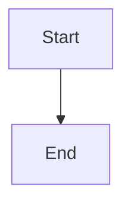

# Mermaid Diagrams

## Overview

**Always use Mermaid syntax for any diagram.** Never use ASCII art, box-drawing characters, Unicode diagrams, or plain-text visual representations.

## Rule

When a diagram is needed — whether explicitly requested by the user or decided by the AI to clarify something — **always use Mermaid** inside a fenced code block with the `mermaid` language tag.

## Automatic Triggers

**Generate a Mermaid diagram WITHOUT being asked when you detect ANY of these patterns in your own output or in skills/documents:**

- A sequential flow described as `A → B → C → D` or `Step 1, Step 2, Step 3...`
- A process with decision points (if/else, branches)
- A lifecycle (create → init → run → cleanup)
- A skill's response pattern or workflow steps
- An architecture with multiple components interacting
- A state machine or status transitions

**If you write a flow in plain text like:**
```
FETCH → READ → CLASSIFY → BRAINSTORM → WAIT → VERIFY → EVALUATE → IMPLEMENT
```
**You MUST also render it as a Mermaid diagram.**

The plain-text version can stay for quick reference, but the Mermaid diagram must accompany it.

## Applies To

- Flowcharts
- Sequence diagrams
- Class diagrams
- State diagrams
- Entity-relationship diagrams
- Gantt charts
- Architecture diagrams
- Skill workflows and response patterns
- Any other visual representation

## Format

````markdown

````

## Forbidden

- ASCII art diagrams (`+---->`, `|`, `===`)
- Unicode box-drawing characters (`┌`, `─`, `└`)
- Plain-text flow representations
- Any non-Mermaid visual diagram format
