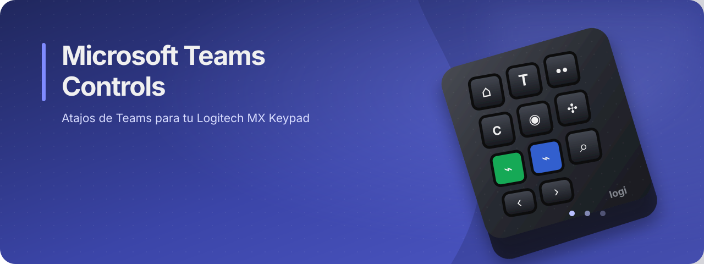

# Microsoft Teams Controls

<p align="center">
  
</p>

Plugin compilado para controlar Microsoft Teams desde un **Logitech MX Keypad** mediante **Logi Options+**.

Permite asignar accesos directos de Teams a los botones del keypad, incluyendo acciones multiestado para la cámara, el micrófono y el uso compartido de contenido.

> Estado del proyecto: experimental. Los nombres y atajos dependen de la versión de Microsoft Teams instalada.

## Características

- Acciones rápidas para navegar por Teams.
- Acciones para chats y llamadas.
- Controles para reuniones.
- Acciones multiestado con iconos diferentes para cámara, micrófono y compartir contenido.
- Iconos personalizados optimizados para el MX Keypad.
- Integración con Teams para macOS y Windows mediante el perfil de la aplicación.

## Requisitos

- Logitech **MX Keypad**.
- **Logi Options+** con el Logi Plugin Service instalado.
- Microsoft Teams de escritorio.
- Un paquete `.lplug4` del plugin para la instalación final.

Logi Options+ está disponible en [la página oficial de Logitech](https://www.logitech.com/software/logi-options-plus.html).

## Instalación

### Instalación desde un paquete

Si has recibido un archivo `.lplug4`:

1. Cierra cualquier versión anterior del plugin o elimina su instalación de desarrollo.
2. Haz doble clic en el archivo `.lplug4`.
3. Confirma la instalación en el instalador de Logi Plugin Service.
4. Reinicia Logi Options+ si el plugin no aparece inmediatamente.
5. Abre la personalización del MX Keypad y busca **Microsoft Teams** en **All Actions** o **Todas las acciones**.

El plugin se activa cuando Microsoft Teams está en primer plano. En macOS utiliza el identificador de aplicación `com.microsoft.teams2`; en Windows utiliza el proceso `ms-teams`.

### Instalación para desarrollo

Esta opción está destinada a quienes trabajan con el código fuente. El proyecto compila una DLL que debe cargarse desde el Logi Plugin Service. El flujo habitual es:

```bash
cd src
dotnet build -c Release
```

La configuración actual del proyecto usa .NET 10 y referencia el `PluginApi.dll` instalado por LogiPluginService. Consulta `AGENTS.md` para conocer el flujo completo de desarrollo, instalación local y empaquetado.

## Configuración en Logi Options+

1. Conecta el MX Keypad y abre Logi Options+.
2. Selecciona el MX Keypad.
3. Abre la pantalla de personalización de controles.
4. Selecciona **Microsoft Teams** como aplicación o enfoca Teams para que se active su perfil.
5. Busca las acciones del plugin en **All Actions**.
6. Arrastra cada acción al botón que quieras utilizar.
7. Abre Microsoft Teams y prueba los botones.

Los comandos envían atajos de teclado a Teams. Por eso Teams debe estar enfocado para que la acción se ejecute en la aplicación correcta.

## Acciones disponibles

Los atajos siguientes corresponden a macOS. En Windows, Logi Options+ aplica el modificador equivalente cuando Teams utiliza el mismo atajo.

### Navegación

| Acción | Atajo en macOS | Descripción |
| --- | --- | --- |
| Actividad | `Cmd+1` | Ir a Actividad |
| Chat | `Cmd+2` | Ir al chat |
| Copilot | `Cmd+3` | Ir a Copilot |
| Calendario | `Cmd+4` | Ir al calendario |
| Llamadas | `Cmd+5` | Ir a Llamadas |
| OneDrive | `Cmd+6` | Ir a OneDrive |
| Turnos | `Cmd+7` | Ir a Turnos |

### Chat y llamadas

| Acción | Atajo en macOS | Descripción |
| --- | --- | --- |
| Abrir chat | `Cmd+Shift+N` | Abrir el panel de chat |
| Llamada de audio | `Option+Cmd+S` | Iniciar una llamada de audio |
| Videollamada | `Cmd+Shift+S` | Iniciar una videollamada |
| Abrir Copilot | `Ctrl+Cmd+I` | Abrir Copilot |
| Canales | `Option+Cmd+A` | Ver canales |
| Chats | `Option+Cmd+C` | Ver chats |
| No leído | `Option+Cmd+U` | Filtrar por elementos no leídos |
| Marcar todos como leídos | `Shift+Esc` | Marcar todos los chats como leídos |
| Contraer todas las secciones | `Shift+Cmd+L` | Contraer las secciones del chat |

### Reuniones

| Acción | Estado inicial | Segundo estado | Atajo en macOS |
| --- | --- | --- | --- |
| Cámara On/Off | Apagar | Encender | `Cmd+Shift+O` |
| Micrófono On/Off | Silenciar | Activar | `Cmd+Shift+M` |
| Compartir contenido | Compartir contenido | Dejar de compartir | `Cmd+Shift+E` |
| Levantar la mano | — | — | `Cmd+Shift+K` |
| Salir | — | — | `Shift+Cmd+H` |

Las acciones multiestado cambian su icono después de cada pulsación para indicar el estado que el plugin espera que esté activo.

### Ventana

| Acción | Atajo en macOS | Descripción |
| --- | --- | --- |
| Contraer barra de aplicaciones | `Cmd+\` | Contraer o expandir la barra de aplicaciones |

## Limitaciones conocidas

- El plugin envía atajos de teclado; no controla Teams mediante una API oficial de sincronización de estado.
- Los estados de cámara, micrófono y compartir contenido son **ópticos**: el plugin alterna su icono después de cada pulsación, pero no puede leer el estado real de Teams.
- Si cambias el estado directamente desde Teams, desde otro dispositivo o mediante otro atajo, el icono del keypad puede quedar desincronizado. Pulsa de nuevo la acción para volver a alinearlo.
- Los atajos pueden cambiar entre versiones, plataformas, idiomas o configuraciones de Teams.
- El perfil solo se activa cuando Teams está en primer plano y es detectado por Logi Options+.
- Cerrar y volver a abrir la ventana de Logi Options+ no siempre recarga un plugin modificado. El Logi Plugin Service puede necesitar un reinicio.

## Solución de problemas

### El plugin no aparece en Logi Options+

1. Comprueba que Logi Plugin Service esté instalado y ejecutándose.
2. Reinicia Logi Options+.
3. Reinicia el Logi Plugin Service desde los ajustes de Logi Options+.
4. Comprueba que el paquete corresponda a la arquitectura y versión de tu instalación.

En macOS, el servicio escanea los plugins al arrancar. Si tienes acceso al equipo de desarrollo, el registro del plugin suele encontrarse en:

```text
~/Library/Application Support/Logi/LogiPluginService/Logs/plugin_logs/MicrosoftTeamsControls.log
```

### El botón no hace nada

- Asegúrate de que Teams está en primer plano.
- Comprueba que la acción esté asignada al control correcto del MX Keypad.
- Prueba el atajo directamente en Teams para confirmar que funciona en tu versión.
- Revisa si otra aplicación o perfil está usando el mismo botón.

### El icono no se actualiza

El estado de los comandos multiestado es interno al plugin. Si se desincroniza, vuelve a pulsar la acción o reinicia el Logi Plugin Service para restablecer el estado inicial.

## Para colaboradores

El código fuente está organizado como un proyecto C# basado en el SDK de plugins de Logi/Loupedeck:

- `src/`: plugin, integración con Teams y comandos.
- `src/EmbeddedResources/`: iconos SVG embebidos para acciones multiestado.
- `actionicons/`: iconos de las acciones.
- `actionsymbols/`: símbolos usados en el selector de acciones.
- `metadata/`: manifiesto del plugin.

Para reglas del proyecto, comandos de verificación, requisitos locales y empaquetado, consulta [`AGENTS.md`](AGENTS.md).

## Licencia

Este proyecto se distribuye bajo la licencia [MIT](https://opensource.org/licenses/MIT).
